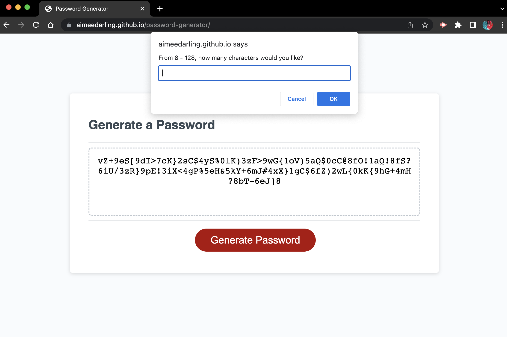

# password-generator-refactor

## Description

Refactor of a password generator JavaScript file to showcase newly learned JavaScript skills. These skills include variable creation using const and let, using prompts and confirms to gather user inputted data, and creating for loops with end parameters.  

## Installation

Visit site [here](https://aimeedarling.github.io/password-generator)

## Usage

Screenshot of completed work

 
 
## Credits

JavaScript for Kids for Dummies by Chris Minnick and Eva Holland ©2015
[JavaScript Array Methods](https://www.w3schools.com/js/js_array_methods.asp)
edX tutoring session with Phillip Loy on 04/20/2023

## License

Please see repo for license information